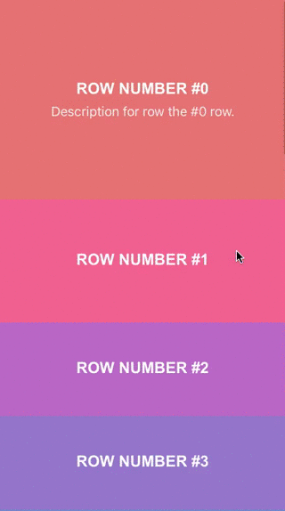

#Description
Simple UICollectionView layout that makes current item bigger when scrolling.

#Installation

    pod 'ILZoomInCollectionViewLayout'

#Usage

Set your UICollectionViewLayout to ILZoomInCollectionViewLayout in interface builder.

For more documentation on `UICollectionViewFlowLayout` and it's usage read [official documentation](https://developer.apple.com/reference/uikit/uicollectionviewflowlayout).